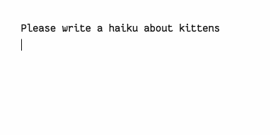

# Simple Note Chat

Use a keyword to chat with LLMs in a note; designed to work great on mobile and desktop. This is a comfortable way to chat without needing keyboard shortcuts or buttons.

The keyword is `cc` in this example (it can be changed):



Any large language model from OpenRouter is accessible. You will need to bring your own API key for this plugin to work.

Conversations have separators added so that messages from the user and the AI are clearly differentiated. This helps LLMs track conversations better, and enables caching which saves money and improves response speeds.

This plugin enables Obsidian to act as a lightweight chat interface for most any LLM. It's a nice replacement for self-hosted web interfaces, which can be clunky, and a replacement for vendor-specific interfaces which only work with their specific LLMs.

## Features

* The follow keywords are available (and can all be modified):
	* `cc` - chat with an LLM
	* `cm` - change the model you are actively chatting with
	* `gg` - archive the note, moving it to a custom folder
	* `nn` - create a new chat note
* You can mask content to prevent it from being included in the chat
	* `^^^` - anything above this will be ignored
* Responses are streamed
* Press `Escape` to quickly stop a stream
* Nearly everything is configurable

## Detailed Examples

### Chatting (`cc`)

Type `cc` on it's own line, then press enter/return to initiate a chat. By default, everything in the note will be processed and sent to the model.

The keywords need to be on their own line to be recognized. So if it occurs inside a sentence it will be ignored.

```markdown
Tell me a haiku about kittens.
cc  <- cc on it's own line, just press enter for it to work
```

```markdown
Tell me a haiku about kittens. cc  <- 'cc' is not on it's own line, so it won't be recognized
```


### Limiting what is sent to the AI

You can quickly limit what is sent to the model by adding a boundary marker. This is useful for notes where you have other things going on, and you only want to chat about something specific quickly.

The boundary marker is `^^^`. Put that on it's own line and anything above the marker will be ignored and not sent to the AI.

**Example:**

```markdown
This is a personal journal note that contains information that I don't want to send to the LLM.
All this content will be ignored since it's above the ^^^ marker.

^^^

What do I need to know about adopting a cat?

cc
```

In this example, the LLM will only see the question about adopting a cat, and not the personal notes.

If you archive the chat afterward (using `gg`), then only content up to the boundary will be cleared and saved to your archive. So it's a fast way to ask a question, save the response somewhere else, then move on with your day.

### Stopping a Response

If the LLM response is not useful or going off track, you can stop it mid-stream by pressing the `Escape` key.

### Changing the Model

Typing `cm` on it's own line will open a model selection modal, making it easy to quickly switch which model you are chatting with.

### Finished with a Chat (`gg`)

To archive a note, type `gg` on it's own line then press enter.

This phrase marks a chat as completed and optionally assigns a title, moving the note to an archive directory of your choice.

For example, the original note might be:
`vault/questions.md`

And then after archiving:
`vault/archive/questions about cats.md`

It's fully configurable, so you can change:
- archive directory
- whether to change the title of the note
- whether to add a date/time prefix, etc.

Currently, archiving will only work on notes that have had a chat session. Although it seems like it would be helpful to archive any note, so this will probably change to be more permissive (or configurable).

### Creating a New Chat Note (`nn`)

Type `nn` to quickly create a new note for chatting.

This provides a shortcut for adding a note to your chat or archive directory quickly. It has some default note title options as well (such as using today's date and time).

### Message Attribution

This is a technical level of detail FYI, so can be ignored if you don't want to know the details.

Messages are separated using a horizontal line. The plugin automatically adds these and uses them to distinguish between user messages and AI responses.

The current algorithm for message attribution is simple, but seems to work well: the first message is assumed to be from the user, the next from the AI, and so on.

**Example of Separators (Source Mode view):**

```markdown
User's first message.

<hr message-from="chat">

AI's first response.

<hr message-from="chat">

User's second message.

<hr message-from="chat">

AI's second response.
```

The `<hr message-from="chat">` separator is unique enough that it should never show up in a response from an AI, so parsing the conversation is fairly robust. The other markdown horizontal rules (`---`, `___`, or `***`) would work, but they are more likely to be part of an AI response, which the plugin would then parse incorrectly when attributing messages.

When parsing the above conversation, this is what would get submitted to the vendor's API:

```
{
  "messages": [
    {
      "role": "user",
      "content": "User's first message."
    },
    {
      "role": "assistant",
      "content": "AI's first response."
    },
    {
      "role": "user",
      "content": "User's second message."
    },
	...
}
```

### Trivia

Each keyphrase has an inspiration:

- `cc` call chat
- `cm` change model
- `nn` new note
- `gg` good game - and signifies the chat is over. Other phrases considered were `ac` for archive chat, `ta` for thanks and see-you-later, or `aa` for *a-archive*

## Contributing

Contributions are welcome!

Please see the [contributing](https://github.com/aarons/obsidian-simple-chat/blob/main/contributing.md) file for development setup and other guidelines.

In short:

* Open a Pull Request (PR) with a clear explanation of the changes.
* Contributions that add third-party dependencies are unlikely to be accepted.

## License

This project is licensed under the **Affero General Public License (AGPL) v3.0**

More details are here: [LICENSE](https://github.com/aarons/obsidian-simple-chat/blob/main/LICENSE)
