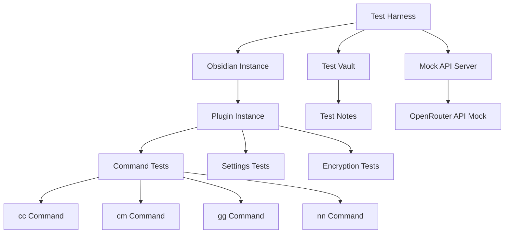
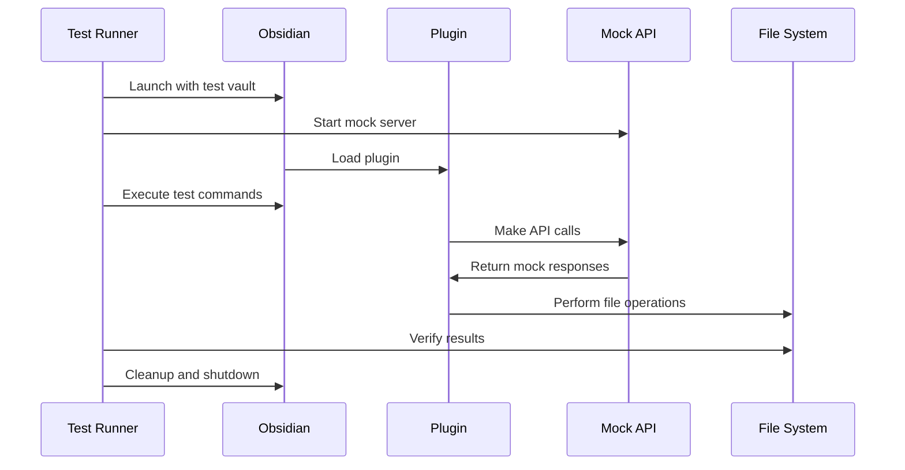

# Comprehensive Testing Strategy for Obsidian Simple Chat Plugin

## Overview

This document outlines a comprehensive testing strategy for the Obsidian Simple Chat plugin that focuses on end-to-end testing with real Obsidian behavior. The approach uses a custom test harness with an actual Obsidian instance to validate core functionality including command execution, API key encryption, and file operations.

## Testing Architecture



## Core Test Categories

### 1. Command Integration Tests
- **cc (Chat Completion)**: Validates entire flow from command detection to API call
- **cm (Change Model)**: Tests modal opening and model selection
- **gg (Archive)**: Tests note archiving with proper validation
- **nn (New Note)**: Tests note creation with various settings

### 2. API Key Encryption Tests
- Settings input validation
- Base64 encoding verification
- Decryption during API calls
- Backward compatibility with unencrypted keys

### 3. End-to-End Integration Tests
- Real Obsidian API interactions
- File system operations
- Editor manipulations
- User interface behaviors

## Detailed Test Implementation Plan

### Phase 1: Test Infrastructure Setup

#### 1. Test Harness Creation
- Custom test runner that launches Obsidian with test vault
- Automated plugin loading and configuration
- Mock API server for OpenRouter endpoints
- Test data management and cleanup

#### 2. Mock API Server
- Express.js server mimicking OpenRouter API
- Configurable responses for different test scenarios
- Request logging and validation
- Support for streaming and non-streaming responses

### Phase 2: Core Command Tests

#### 1. CC Command Test Suite
```typescript
// Test: cc<enter> triggers API call with correct data
- Create test note with content
- Type "cc" and press Enter
- Verify command line removal
- Verify API call with decoded key
- Verify response streaming to editor
```

#### 2. CM Command Test Suite
```typescript
// Test: cm<enter> opens model selector
- Type "cm" and press Enter
- Verify command line removal
- Verify modal opens
- Test model selection and saving
```

#### 3. GG Command Test Suite
```typescript
// Test: gg<enter> archives note correctly
- Create note with chat separator
- Type "gg" and press Enter
- Verify note moved to archive folder
- Verify status message appended
```

#### 4. NN Command Test Suite
```typescript
// Test: nn<enter> creates new note
- Type "nn" and press Enter
- Verify new note creation
- Verify proper naming and location
```

### Phase 3: Encryption & Settings Tests

#### 1. API Key Encryption Tests
```typescript
// Test: Settings input encrypts API key
- Open settings tab
- Enter API key
- Save settings
- Verify data.json contains base64 encoded key
- Verify in-memory key is decrypted
```

#### 2. API Call Authentication Tests
```typescript
// Test: API calls use decrypted key
- Set encrypted API key in settings
- Trigger cc command
- Verify API request contains original key
- Verify no encrypted key in request
```

## Test File Structure

```
tests/
├── harness/
│   ├── test-runner.ts          # Main test orchestrator
│   ├── obsidian-launcher.ts    # Obsidian instance management
│   ├── mock-api-server.ts      # OpenRouter API mock
│   └── test-utilities.ts       # Helper functions
├── integration/
│   ├── command-tests.ts        # cc, cm, gg, nn tests
│   ├── encryption-tests.ts     # API key encryption tests
│   ├── settings-tests.ts       # Settings tab tests
│   └── file-operations-tests.ts # Archive/create tests
├── fixtures/
│   ├── test-notes/            # Sample notes for testing
│   ├── api-responses/         # Mock API response data
│   └── settings-configs/      # Test settings configurations
└── test-vault-template/       # Clean vault template
```

## Key Testing Technologies

1. **Test Framework**: Custom harness with TypeScript
2. **Obsidian Integration**: Electron app automation
3. **API Mocking**: Express.js server with configurable responses
4. **Assertions**: Chai or similar assertion library
5. **File System**: Node.js fs operations for vault manipulation

## Test Execution Flow



## Specific Test Scenarios

### CC Command Test
```typescript
async function testCCCommand() {
  // Setup: Create note with content
  await createTestNote("Test note content\ncc");

  // Action: Simulate Enter key on cc line
  await simulateKeyPress("Enter", { line: 1, ch: 2 });

  // Assertions:
  // 1. Command line removed from editor
  // 2. API call made with correct parameters
  // 3. Decrypted API key used in request
  // 4. Response streamed to editor
  // 5. Chat separator added
}
```

### Encryption Test
```typescript
async function testAPIKeyEncryption() {
  const testKey = "sk-or-test-key-123";

  // Action: Set API key in settings
  await setPluginSetting("apiKey", testKey);

  // Assertions:
  // 1. data.json contains base64 encoded key
  // 2. In-memory settings contain plain key
  // 3. API calls use plain key
  const savedData = await readDataJson();
  assert(savedData.apiKey.startsWith("snc_encrypted:"));
  assert(plugin.settings.apiKey === testKey);
}
```

## Core Test Requirements

### Command Behavior Tests
1. **cc<enter>** should call the OpenRouter service with contents of the note correctly parsed
2. **cm<enter>** should pull up the change model modal
3. **gg<enter>** should archive the note correctly
4. **nn<enter>** should create a new note

### API Key Encryption Tests
1. User can enter a key in settings
2. Key is actually base64 encoded when saved to data.json
3. When user types cc<enter> (or enters this code path through various means), the API gets called with the decoded API key

## Benefits of This Approach

1. **Real Obsidian Behavior**: Tests against actual Obsidian API
2. **End-to-End Coverage**: Validates complete user workflows
3. **API Integration**: Verifies actual API call behavior
4. **File System Testing**: Confirms vault operations work correctly
5. **Settings Validation**: Ensures encryption/decryption works properly

## Implementation Timeline

1. **Week 1**: Test harness and infrastructure
2. **Week 2**: Basic command tests (cc, cm, gg, nn)
3. **Week 3**: Encryption and settings tests
4. **Week 4**: Edge cases and error handling tests

## Getting Started

1. Set up the test infrastructure in the `tests/` directory
2. Create the mock API server for OpenRouter endpoints
3. Implement the Obsidian launcher and test harness
4. Begin with basic command tests
5. Add encryption and settings validation tests
6. Expand to cover edge cases and error scenarios

This testing strategy ensures comprehensive coverage of the plugin's core functionality while testing against real Obsidian behavior, providing confidence that the plugin works correctly in actual usage scenarios.